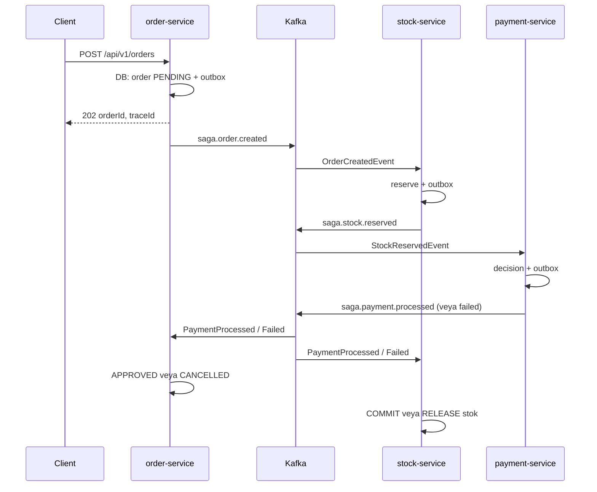

# Mikroservis Saga (Koreografi) Demosu

Sipariş → stok → ödeme zincirini **orkestratör olmadan**, servislerin Kafka üzerinden birbirini **olaylarla tetiklediği** bir [koreografi tabanlı saga](https://microservices.io/patterns/data/saga.html) örneği.  
**Java 21**, **Spring Boot 3.5**, **Apache Kafka**, **PostgreSQL** (servis başına mantıksal veritabanı), **transactional outbox** ve **idempotent tüketim** kullanılır. Dağıtık iz için **Zipkin** entegrasyonu vardır.

## Modüller

| Modül | Açıklama |
|--------|----------|
| `saga-common` | Paylaşılan topic isimleri, olay tipleri (`OrderCreatedEvent`, …), iz başlıkları |
| `order-service` | HTTP ile sipariş kabulü, `saga.order.created` yayını (outbox), ödeme sonucuna göre sipariş durumu |
| `stock-service` | Siparişe göre rezervasyon / commit / iptal, stok olaylarını outbox ile yayınlar |
| `payment-service` | Stok rezerve edildikten sonra ödeme kararı (yapılandırmayla başarısızlık simülasyonu) |

HTTP girişi yalnızca **order-service** üzerindedir (`8081`). Stok ve ödeme servisleri Kafka ile konuşur.

## Ön koşullar

- **JDK 21**
- **Maven 3.9+**
- **Docker** ve **Docker Compose** (altyapı için)

## Altyapıyı çalıştırma

Proje kökünde:

```bash
docker compose up -d
```

Bu komut şunları ayağa kaldırır:

| Servis | Port | Not |
|--------|------|-----|
| Kafka | `9092` (host), `29092` (Docker ağı) | Zookeeper ile birlikte |
| Zookeeper | `2181` | |
| PostgreSQL | `5432` | `orderdb`, `stockdb`, `paymentdb` otomatik oluşturulur (`docker/postgres/init-databases.sql`) |
| Zipkin | `9411` | Bellekte saklama (`STORAGE_TYPE=mem`) |

## Uygulamaları çalıştırma

Üç Spring Boot uygulamasını **ayrı terminallerde** (veya IDE’den) başlatın:

```bash
# 1) Ortak kütüphane
mvn -pl saga-common install

# 2) Servisler (sıra önemli değil; hepsi ayakta olmalı)
mvn -pl order-service spring-boot:run
mvn -pl stock-service spring-boot:run
mvn -pl payment-service spring-boot:run
```

Varsayılan portlar: **order** `8081`, **stock** `8082`, **payment** `8083`.

## Sipariş oluşturma (örnek istek)

Yerel stok seed’i **`DEMO-SKU`** (miktar `100`) ile gelir.

```bash
curl -sS -X POST 'http://localhost:8081/api/v1/orders' \
  -H 'Content-Type: application/json' \
  -d '{
    "customerId": "cust-001",
    "totalAmount": 99.99,
    "sku": "DEMO-SKU",
    "quantity": 1
  }'
```

Yanıt **202 Accepted** ve gövdede `orderId` ile `traceId` döner.

## Saga akışı (mutlu senaryo)

1. **Order** siparişi `PENDING` kaydeder, olayı **outbox** tablosuna yazar; zamanlayıcı outbox’tan `saga.order.created` topic’ine yayınlar.
2. **Stock** `OrderCreatedEvent` alır: stok yeterliyse envanter düşer, rezervasyon `RESERVED` olur; `StockReservedEvent` outbox ile `saga.stock.reserved` topic’ine gider.
3. **Payment** `StockReservedEvent` alır: başarılı kararda `PaymentProcessedEvent` → `saga.payment.processed`.
4. **Order** `PaymentProcessedEvent` ile siparişi **APPROVED** yapar.
5. **Stock** aynı `PaymentProcessedEvent` ile rezervasyonu **COMMITTED** yapar (stok kesin düşmüş kalır).

Ödeme reddedilirse `saga.payment.failed` yayınlanır: **Order** siparişi **CANCELLED** yapar; **Stock** rezervasyonu iptal edip miktarı envantere geri yazar.



## Kafka topic’leri

| Topic | Kim yazar | Kim dinler (özet) |
|--------|-----------|-------------------|
| `saga.order.created` | order (outbox) | stock |
| `saga.stock.reserved` | stock (outbox) | payment |
| `saga.stock.limit-exceeded` | stock (outbox) | Stok yetersiz / bilinmeyen SKU; olay topic’e gider |
| `saga.payment.processed` | payment (outbox) | order, stock |
| `saga.payment.failed` | payment (outbox) | order, stock |

Olay yayınları **outbox deseni** ile veritabanı commit’i ile uyumludur; tüketicilerde **event id** ile idempotency uygulanır.

## Ödeme başarısızlığını denemek

`payment-service` içinde `application.yml`:

```yaml
saga:
  payment:
    simulate-failure: true
```

Bu açıkken ödeme `PaymentFailedEvent` üretir; sipariş iptal ve stok iadesi akışı tetiklenir.

## Zipkin ve loglar

- Tarayıcı: `http://localhost:9411` — trace’leri inceleyin.
- Loglarda `traceId` için MDC kullanılır; Kafka üzerinde `TraceKafkaHeaders` ile taşınır.

## Kafka’dan mesaj izleme

Örnek (konteyner adını `docker ps` ile doğrulayın):

```bash
docker exec -it <kafka-container> kafka-console-consumer \
  --bootstrap-server kafka:29092 \
  --topic saga.order.created \
  --from-beginning
```

## Proje yapısı (özet)

```
microservice-saga-demo/
├── docker-compose.yml          # Kafka, Zookeeper, Postgres, Zipkin
├── docker/postgres/            # İlk kurulum SQL (3 veritabanı)
├── saga-common/                # Ortak olaylar ve topic sabitleri
├── order-service/
├── stock-service/
└── payment-service/
```

---

Bu depo eğitim ve deney amaçlıdır; üretim için güvenlik, gözlemlenebilirlik ve hata senaryoları ayrıca sertleştirilmelidir.
